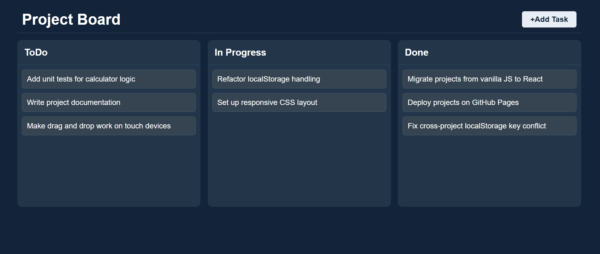

# Kanban Board 📋

A responsive, drag-and-drop project management board built with vanilla JavaScript, CSS Grid, and LocalStorage persistence.

## Live Demo
🔗 [View Live Application](https://piyushdhakad001.github.io/js-kanban-board/)

## Screenshot



## Features
- **Drag-and-Drop Workflow:** Seamlessly drag tasks between **ToDo**, **In Progress**, and **Done** columns.
- **Task Creation:** Quickly add new tasks with dynamic prompt inputs.
- **Persistent State:** Automatically saves board states using browser `localStorage` across page refreshes.
- **Responsive Layout:** Adaptive CSS Grid layout optimized for mobile, tablet, and desktop viewports.

## Tech Stack
- **HTML5** (Semantic structure)
- **CSS3** (CSS Grid, Flexbox, Media Queries)
- **JavaScript (ES6+)** (HTML5 Drag and Drop API, DOM manipulation, LocalStorage)

## Getting Started Locally
1. Clone the repository:
   ```bash
   git clone [https://github.com/piyushdhakad001/js-kanban-board.git](https://github.com/piyushdhakad001/js-kanban-board.git)